# 功能

这里我想以实现的功能作为主线对这款rat进行解析，我们先看看它实现了哪些功能


## Send File


**ToMemory**

内存加载exe文件，支持以下两种类型:

1. Reflection

使用Assembly.Load加载C#程序

1. RunPE

通过替换进程内存的方式加载exe文件

可选择以下程序作为被注入的程序：

- aspnet_compiler.exe
- RegAsm.exe
- MSBuild.exe
- RegSvcs.exe
- vbc.exe


**ToDisk**

将exe文件上传到目标主机的`%Temp%`目录，重命名为随机字符串，再使用Powershell启动exe文件，执行后不会删除`%Temp%`目录下的exe文件


## Monitoring


**Remote Desktop**

监控屏幕，实时获得目标桌面的内容


**Keylogger**

实时获得目标主机键盘输入的消息和进程名称


**Password Recovery**

获得Firefox和Chrome浏览器中保存的密码


**File Manager**

文件管理，还支持隐蔽安装7zip和对文件的压缩及解压缩


**Process Manager**

进程管理，支持查看进程和关闭进程


**Report Window**

监控重要进程，当目标主机上运行指定进程时，控制端弹出提示消息


**Webcam**

开启摄像头


## Miscellaneous


Bots Killer

清除恶意进程在注册表HKLM和HKCU下`\Software\Microsoft\Windows\CurrentVersion\Run`和`Software\Microsoft\Windows\CurrentVersion\RunOnce`保存的项


USB Spread

当目标主机连接U盘时，感染U盘中的文件


Seed Torrent

向目标主机发送种子文件并下载

目标主机需要安装uTorrent或者BitTorrent


Remote Shell

弹出一个交互式的cmd窗口


DOS Attack

向指定域名持续发送HTTP数据包


Execute .NET Code

在目标主机上动态编译C#或者VB代码并执行


file searcher

搜索指定文件


## Extra


**Visit Website**

启动默认浏览器并访问指定URL，界面不隐藏


**Send MessageBox**

在目标主机上弹出对话框


**Chat**

在目标主机上弹出对话框，实时显示输入的内容


**Get Admin Privileges**

使用cmd.exe以Admin权限重新启动木马客户端，这个操作会在用户桌面弹出UAC框，需要用户选择允许后才能运行

如果用户未选择允许，会一直弹出UAC对话框


**Blank Screen**

Run功能：

通过WinAPI CreateDesktop()创建一个随机名称的虚拟桌面，内容为空，当切换到这个空的虚拟桌面时，用户无法对桌面进行操作

Stop功能：

通过WinAPI SwitchDesktop()切换到原来的桌面


**Disable Windows Defender**

通过修改注册表的方式关闭Windows Defender，通常在Win10系统上使用


**Set Wallpaper**

设置用户的桌面


## builder

**Connection**


DNS：指定C2 Server的IP，可以设置多个

Port：指定C2 Server的端口，可以设置多个

Pastebin：从Pastebin.com读取C2 Server的信息，包括DNS和Port


**Install**

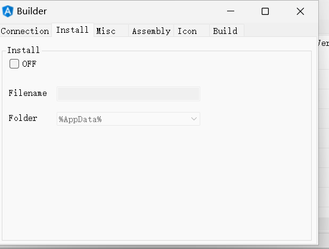

用作配置木马客户端自启动的功能

开启这个功能后会将木马客户端复制到指定位置

文件名称可以重新命名

文件路径可选择`%AppData%`或`%Temp%`目录

当木马客户端以普通用户权限执行时，会在注册表`HKCU\Software\Microsoft\Windows\CurrentVersion\Run`添加项，以新的木马客户端名称作为注册表项的名称，以新的木马客户端路径作为注册表项的数据

当木马客户端以管理员权限执行时，会使用schtasks命令创建计划任务


**Misc**


Group：对木马客户端进行分类

Mutex：设置互斥量，避免木马客户端的重复启动

Anti Analysis：

包括以下功能：

- DetectManufacturer，通过WMI获得系统信息(`Select * from Win32_ComputerSystem`)，查看Manufacturer是否包含字符VIRTUAL、vmware或VirtualBox
- DetectDebugger，使用WinApi CheckRemoteDebuggerPresent()检查是否为调试器
- DetectSandboxie，使用WinApi GetModuleHandle()检查SbieDll.dll是否存在
- IsSmallDisk，检查硬盘大小是否小于60Gb
- IsXP，检查系统名称是否包含字符xp

Process Critica：

将进程设置为保护进程，如果意外关闭了保护进程，那么将导致BSOD

Delay：延迟执行的时间


**Assembly**


可以手动设置文件属性，也可以复制指定文件的文件属性


**Icon**

设置文件图标


**Build**

Simple Obfuscator：通过重命名的方式实现简单的混淆


# 

# send file

## To Memory


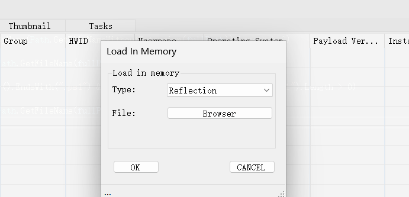


一共两个选项，分别是反射和runpe

### Server


这里是ToMemory功能的代码，这里新建了一个`FormSendFileToMemory`类


这里反射加载的实现方式就是直接调用ReferenceLoader类的AppDomainSetup方法


创建了一个AppDomain来反射加载


这里是调用了Assembly的ReflectionOnlyLoadFrom来加载指定路径的程序集，加载到只反射上下文中，这里还不是执行，就是返回所需的资源，接下来就是构建数据包


当`IsOK`为`TRUE`的时候，也就是用户选择完了，接下来开始构造数据包

创建一个新的`MsgPack`对`packet`

设置"Packet"键：使用`ForcePathObject`方法为`packe`t对象添加一个名为"Packet"的键，并设置其值为"sendMemory"。


设置"File"键：读取用户通过窗体选择的文件内容，使用`File.ReadAllBytes`方法将文件内容读取为字节数组。然后，通过`Zip.Compress`方法对这些字节进行压缩，以减小需要传输的数据量。压缩后的字节数据被设置为"File"键的值。


设置"Inject"键：根据用户在`FormSendFileToMemory`窗体中的选择


创建另一个新的`MsgPack`对象`msgpack`

设置"Packet"键**：为`msgpack`对象添加一个名为"Packet"的键，其值为"plugin"。这表示这个数据包是一个插件相关的消息。


设置"Dll"键**：使用`GetHash.GetChecksum`方法计算`"Plugins\SendMemory.dll"`的校验和，并将其作为"Dll"键的值。


设置"Msgpack"键**：将先前创建的`packet`数据包序列化为字节（通过`Encode2Bytes`方法），并设置为"Msgpack"键的值。


通过GetSelecredClients方法获取上线的机器，这里只会返回被选中的机器


`ThreadPool.QueueUserWorkItem(client.Send, msgpack.Encode2Bytes());`: 将 `msgpack` 对象的字节流发送给客户端对象的 `Send` 方法，使用线程池来异步执行发送操作。

### client


获取`server`发送的数据包，根据其中的`Packet`选择不同的分支


`ToMemory`是这个分支，如果获取到的值不为 `null`，则说明插件已经安装过，此时会调用 `Invoke` 方法来执行插件。如果没有安装这个插件会发送请求，安装这个插件


服务端中这里处理安装插件的请求


变量，并寻找对应hash的插件，返回给client端


client端处理这个请求

**保存插件到注册表**：首先，客户端使用 `SetRegistry.SetValue` 方法将插件的二进制数据保存到注册表中。插件数据是通过 `unpack_msgpack.ForcePathObject("Dll").GetAsBytes()` 从接收到的消息包中提取的。插件的哈希值作为键（`unpack_msgpack.ForcePathObject("Hash").AsString`），这确保了每个插件在注册表中都有唯一的标识。


然后再从注册表中解压数据，解压后的字节数据被 `AppDomain.CurrentDomain.Load` 方法加载为 .NET 程序集（`Assembly`）


创建插件实例

1. **获取插件类型并创建实例**：通过程序集对象调用 `GetType` 方法获取插件的主类型（这里为 `"Plugin.Plugin"，也就是从命名空间Plugin中实例化Plugin类`）。然后使用 `Activator.CreateInstance` 方法创建这个类型的实例。这里使用 `dynamic` 关键字，因此后续对插件实例的操作不需要静态类型检查，这增加了灵活性。

执行插件

1. **执行插件的 `Run` 方法**：插件实例上调用 `Run` 方法，传递一系列参数，包括客户端的 TCP 连接、服务器证书、硬件ID（`Hwid`）、额外的消息包数据（通过 `unpack_msgpack.ForcePathObject("Msgpack").GetAsBytes()` 获取），以及一些配置和状态信息（例如，互斥锁名称、是否启用特定功能等）。这些参数为插件提供了执行所需的上下文和资源。

确认接收

1. **确认接收**：最后，调用 `Received` 方法，可能用于向服务器发送一个确认消息，表明插件已成功接收并执行。

操作的注册表主要是在这里

HKEY_CURRENT_USER\Software\<Hwid>


安装的插件是这个，那么问题来了，压缩的东西去哪了？全程没看到使用file这个键值


先加载了SendMemory.dll，然后这个dll在读取数据包中的键是否为SendMemory


读取数据到buffer变量中，再判断是否有Inject的选择


如果没有选择Inject，直接解压并反射加载


如果选择了RunPE也就是选择了Inject的选项，就会调用ExeCute方法


这里先创建一个挂起的进程，然后获取上下文环境


把数据写到挂起的进程中


处理节


这里没有处理导入表和重定位表，真的没问题吗，根据测试，我使用了，x86 x64的cs生成的木马，都没有成功加载emmmm


### 小结

1. server发送plugin的hash,file的zip压缩数据至client
2. client判断是否安装plugin，这里判断的方式是再注册表中寻找
3. 如果判断则反射加载这个插件也就是sendfile.dll
4. 如果没有安装发送sendPlugin到server
5. server返回插件的zip压缩数据
6. client保存到注册表中，并解压反射加载这个dll
7. dll中获取最开始server发送的file的zip压缩数据
8. 判断是反射加载，还是挂起进程，然后loadpe
9. 加载cs生成的木马没有成功,反射加载应该只能加载c#程序，注入也没成功


## To Disk

### server


和上面那个差不多，主要的实现功能再SendFile.dll中


### client


同样最开始发送的数据包中都带有plugin，和文件的zip压缩数据，然后判断是否安装了这个dll，如果没有安装就去请求安装，然后加载


在这里判断数据包中是否带有SendFile的字段


如果有先保存到temp路径，生成唯一的文件名，判断是否为ps1，如果是则使用powershell运行脚本


如果不是也使用powershell运行exe，命令行有些不一样


### 小结

1. server发送plugin的hash和文件的zip数据
2. 如果安装了插件则反射加载dll
3. 如果没有安装，向服务器请求SendFile.dll的压缩数据
4. 将SendFile.dll的压缩数据保存在注册表中，然后反射加载
5. SendFile.dll中将file的zip压缩数据，解压到temp路径中
6. 使用powershell执行解压后的文件


# Monitoring

## Remote Desktop

### server


这里看看FormRemoteDesktop类


核心的代码是这里，当标签为play的时候发送数据包给client，paclet的类似的remoteDesktop，操作是capture，还有质量和屏幕大小


从 `numericUpDown1` 控件获取用户设置的质量值，作为参数创建 `UnsafeStreamCodec` 的新实例。这个实例将用于后续的图像数据编解码工作，以实现远程桌面的实时显示。在开始远程桌面捕获之前进行此初始化，确保捕获的远程桌面图像能够根据指定的质量参数进行压缩，从而优化数据传输效率和显示质量。


如果最开始不为play则设置为play并发送停止的数据包


鼠标点击事件

首先，确认以下条件是否都满足：

`btnStart.Tag` 的值为 `"stop"`，表示远程桌面的捕获和控制功能当前是激活状态。

`pictureBox1.Image` 不为空，意味着当前有显示的远程桌面图像。

`pictureBox1` 控件当前拥有焦点，确保用户的操作意图是针对远程桌面的。

`isMouse` 标志位为 `true`，表示允许鼠标控制。

会把计算后的xy轴发过去


同样的还有鼠标释放


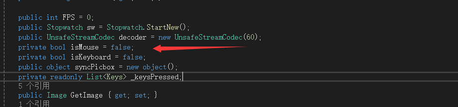

这里isMouse被设置false，可以在选项中设置为true


鼠标移动事件，这里也会永假所以只能监控


键盘事件，但按键会执行，同样会发过去


还有键盘松开的事件


寻找选中的机器中是否开启过远程桌面，如果没有则重新实例化一个，如果有则调用构造方法把窗口显示出来


### client


同上，反射加载dll


反射的dll一共有5种分支


#### capture


调用CaptureAndSend方法把视频的质量和编号传过去


在CaptureAndSend中先调用了GetScreen


会返回一共位图bitmap

首先确定屏幕的尺寸和位置，然后创建一个 `Bitmap` 对象来存储截图，并使用 `Graphics.CopyFromScreen` 方法来填充这个位图。如果启用了光标显示，光标也会被绘制到截图上。


使用显示器的尺寸创建一共bitmap


通过 `Graphics.FromImage` 方法创建一个 `Graphics` 对象，在 `bmpScreenshot` 上绘图。

`CopyFromScreen` 方法将屏幕的指定部分复制到 `bmpScreenshot` 上。源区域由 `rect` 的左上角坐标和尺寸指定，目标区域位于位图的左上角（0,0）。`CopyPixelOperation.SourceCopy` 指定复制操作应该直接复制像素。


定义一个 `CURSORINFO` 结构体变量 `pci`，并设置其 `cbSize` 字段为结构体的大小。这是调用 `GetCursorInfo` 函数的必要准备步骤，该函数填充 `pci` 结构体，提供当前光标的信息并绘制。


得到屏幕后

确定截图的尺寸和位置，准备对其进行处理。

使用 `LockBits` 方法锁定位图的一部分以便直接访问其像素数据，准备进行编码。


创建一个 `MemoryStream`，用作编码后图像数据的临时存储。

使用 `unsafeCodec`（一个实现了 `IUnsafeCodec` 接口的对象，这里是 `UnsafeStreamCodec` 实例）对图像数据进行编码，并将编码后的数据写入到 `stream` 中。

如果 `stream` 中有数据（即编码成功），构造一个 `MsgPack` 对象，填充必要的信息，包括截图数据和其他相关信息，然后异步发送到远程端。


##### server


服务端接受收，调用Capture方法


根据id打开对象


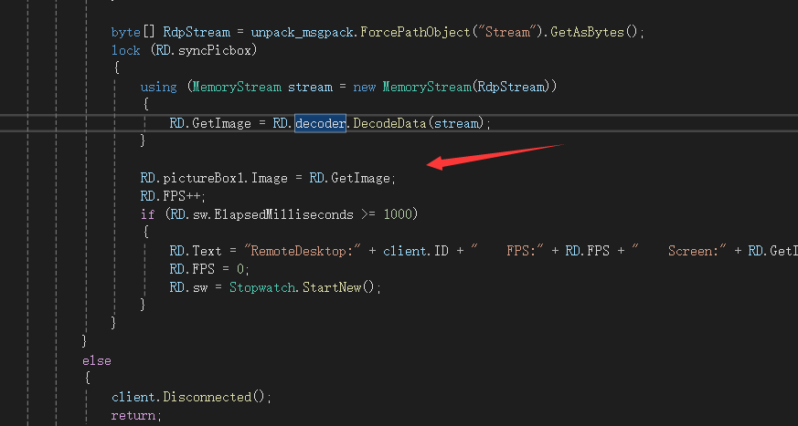

获取数据包中的流，更新到控件中。这样就完成了远程桌面


#### mouseClick


直接调用windows api实现


#### mouseMove


鼠标移动调用了SetCursorPos


#### keyboardClick


调用了keybd_event


### 小结

实现思路

1. 反射加载RemoteDesktop.dll，解析不同类型的数据包
2. 调用api捕获client的屏幕并返回给server，server更新对应的控件
3. 其他操作调用winapi完成


## Keylogger


反射加载的是LimeLogger.dll


这里创建了LowLevelKeyboardProc函数


直接就是键盘事件


设置键盘钩子 `SetWindowsHookEx`


并在钩子回调 (`HookCallback`) 中处理键盘事件


使用 `Marshal.ReadInt32` 方法从 `lParam` 中读取按下的键的虚拟键码 `vkCode`

1. 根据虚拟键码 `vkCode` 使用 `KeyboardLayout` 方法获取当前键盘布局下对应的字符。
2. 如果大写锁定键或 Shift 键被按下，则将 `currentKey` 转换为大写字母；否则，将 `currentKey` 转换为小写字母。
3. 如果按下的键是 F1 到 F24 键之间的功能键，将 `currentKey` 设置为包含键名的字符串。
4. 否则，根据特定的键名进行处理，将 `currentKey` 设置为相应的字符串。
5. 如果currentKey不为空，则执行以下操作：

创建一个 `StringBuilder` 对象 `sb`。

如果当前活动窗口的标题与上次记录的活动窗口标题相同，将 `currentKey` 追加到 `sb` 中。

否则，将包含时间、活动窗口标题和 `currentKey` 的字符串追加到 `sb` 中。

创建一个 `MsgPack` 对象 `msgpack`。

在 `msgpack` 对象中设置属性 "Packet" 的值为 "keyLogger"。

在 `msgpack` 对象中设置属性 "Hwid" 的值为 `Connection.Hwid`。

在 `msgpack` 对象中设置属性 "log" 的值为 `sb.ToString()`。

使用 `Connection.Send` 方法将 `msgpack` 对象的编码后的字节数组发送给服务器。

1. 最后，调用 `CallNextHookEx` 方法将事件传递给下一个钩子程序。
2. 如果在执行过程中出现异常，将返回 `IntPtr.Zero`。


这里还处理了剪切板


将当前窗体设置为一个特殊的消息处理窗体，并注册为剪贴板监听器


重写 `WndProc` 方法，将剪贴板中的内容也会发送给server


### 小结

感觉比较朴素


## Password Recovery


具体实现在Recovery.dll中


这里他只留下了chrom的，firefox被注释掉了，我们进入到Browsers.Chromium.Chromium.Recovery中看看


遍历ChromiumPaths字典，恢复每个浏览器的账户信息，并将结果添加到传入的StringBuilder对象中。


new了一个Account的字典，再调用Accounts方法


调用了GetAllProfiles


根据传入的路径追加\Default\Login Data和\Login Data，然后返回这两路径


如果存在文件，则作为SQLite数据库，并寻找url登录的用户名和密码，这里都是密文，还需要MasterKey


这个SQLiteHandler是他自己写的进去看看


首先是构造函数

接受一个数据库文件的路径作为参数。

验证文件是否存在，并以二进制模式打开文件，读取内容到`db_bytes`字节数组中。

验证数据库文件是否为有效的SQLite格式。

读取数据库的页面大小和编码格式。

从100字节偏移处开始读取主表，通常是数据库的入口点。

其他的方法看着头疼，但是我会复制粘贴


随后查看是否存在logins这个表，不存在就下一次循环


再去调用了GetRowCount()方法，和GetValue方法


这里返回一个长度


会一直递归搜索传入的字段


这样就找到了需要的数据，接着需要解密，如果开头是v10或者v11的话，调用GetMasterKey，把path传入


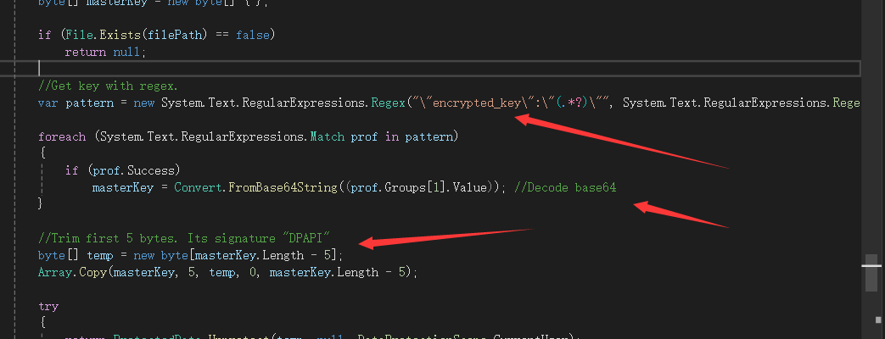

用正则表达式找到masterkey的密文，再base64解码，去掉开头的5个字节，这里是签名使用`ProtectedData.Unprotect`方法解密密钥。这个方法是.NET Framework提供的，用于解密用DPAPI加密的数据。解密是在当前用户的上下文中进行的。这样就得到了MasterKey


得到MasterKey后再调用DecryptWithKey


使用AES-GCM解密数据的方法，这样一顿操作就能使用MasterKey解密数据了


如果不是新版则调用Decrypt，旧版使用DPAPI加密用户数据


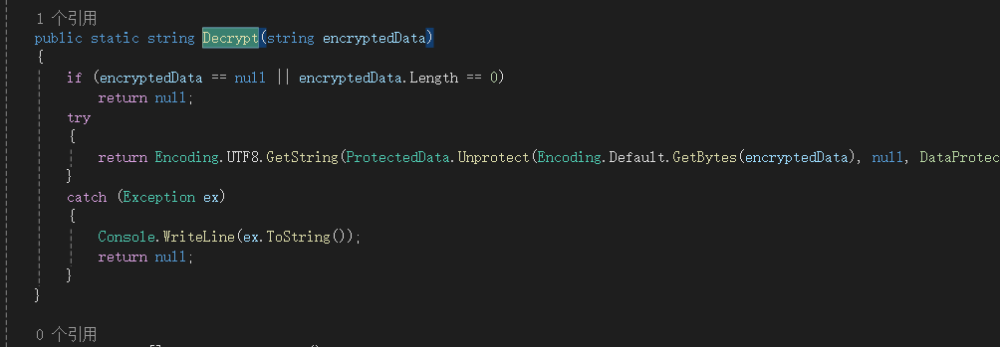

这里就是直接调用自带的方法实现解密了


如果都不为空就加入list中


这样循环一圈完再封包发送给server


## File Manager


也是反射加载这个dll，直接转过去看是啥


发送的数据包中包括了路径


发包的代码再FormFileManager中实现了


这里分了很多不同的操作，我们直接看dll


这里一共有以下分支，getDrivers、getPath、uploadFile、reqUploadFile、socketDownload、deleteFile、execute、createFolder、createFolder、copyFile、pasteFile、renameFile、renameFolder、renameFolder和installZip


### getDrivers


我们进入这个方法看看


主要是这个方法，然后在处理一下发回去


### getPath


如果是DESKTOP、APPDATA、USER则从环境变量中选中路径，并赋值给path，否则就调用自带的函数打开路径读取，然后处理一下字符串发送给server。看了看主要解析一下上传、下载、解压、安装解压这几个功能，其他就是调用自带的一些方法实现


### reqUploadFile


打开一个文件管理器


遍历选中的文件


设置FormDownLoadFile中一些初始化信息后，将生成的唯一标识符作为id发送给client


这里会把传入的id到ReqUpload方法中


这里new了一个tempSocket


构造函数 `TempSocket()`

检查当前是否已经存在一个活动连接。如果没有，尝试建立一个新的TCP连接和SSL流。

设置TCP客户端的接收和发送缓冲区大小。

连接到服务器的特定端点。这里使用 `Connection.TcpClient.RemoteEndPoint` 获取远程服务器的IP地址和端口号。

通过SSL流（`SslStream`）进行身份验证，使用TLS协议确保通信的安全性。

初始化数据接收过程，准备接收来自服务器的数据。


调用其中的send方法发送hwid和命令，还有生成的文件唯一标识符


server收到


将文件读取为字节发送给client端，这个时候的命令是uploadfile


### uploadFile


收到uploadFile指令，检查路径是否存在文件，如果存在就删掉，然后保存到文件中，这就是整个流程


### socketDownload


获取到选中的要下载的文件，并确保存在，然后生成对应的guid，并发送给客户端


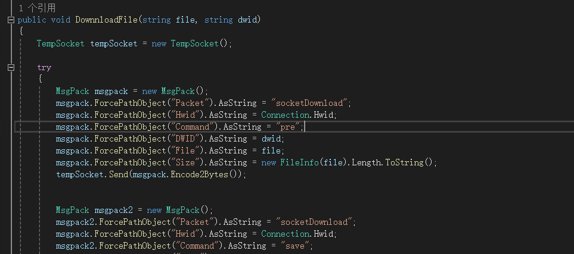

client端再new一个TempSocket类，把文件大小，和生成的guid返回给server，此时的命令是pre


再把文件转为字节发送给server，此时的命令是save


当server收到pre指令后，会根据guid实例化一共FormDownLoadFile，并初始化相关信息


当server收到save收根据pre指令实例化的FormDownLoadFile来异步的保存文件


### installZip


发起installzip指令后会调用InstallSevenZip


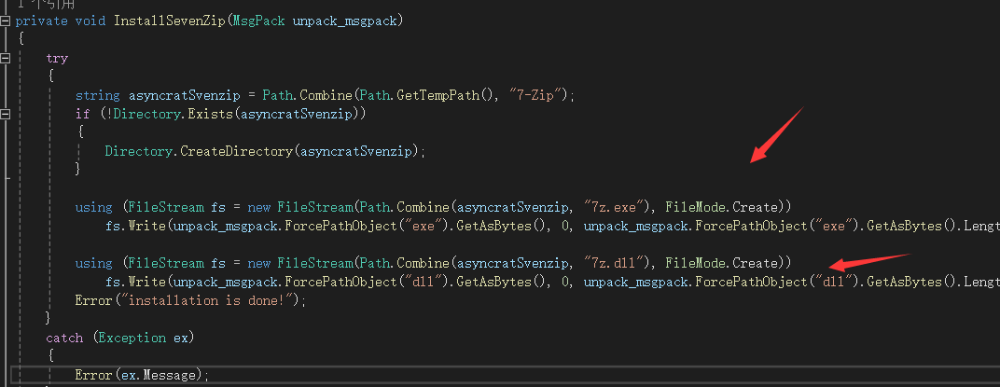

会在临时目录下释放7z.exe和7z.dll放在7-zip文件夹中


### zip


先检查是否安装


这里就是检查对应的目录是否存在7z.exe和7z.dll


遍历路径，构造压缩命令行


调用命令行解压zip


## Process Manager


反射加载ProcessManager.dll，具体是实现再FormProcessManager中


发包主要分为kill和list


### list


调用HandleProcessManager().ProcessList()方法


使用WMI（Windows Management Instrumentation）查询来获取系统上所有进程的ID、名称和可执行路径，然后就是处理查询结果并发送给server了


### kill


kill就调用系统自带的就行了，然后再调用list指令对应的方法


## Report Window


使用效果是这样，输入需要监控的程序，如果执行了就会弹出提醒


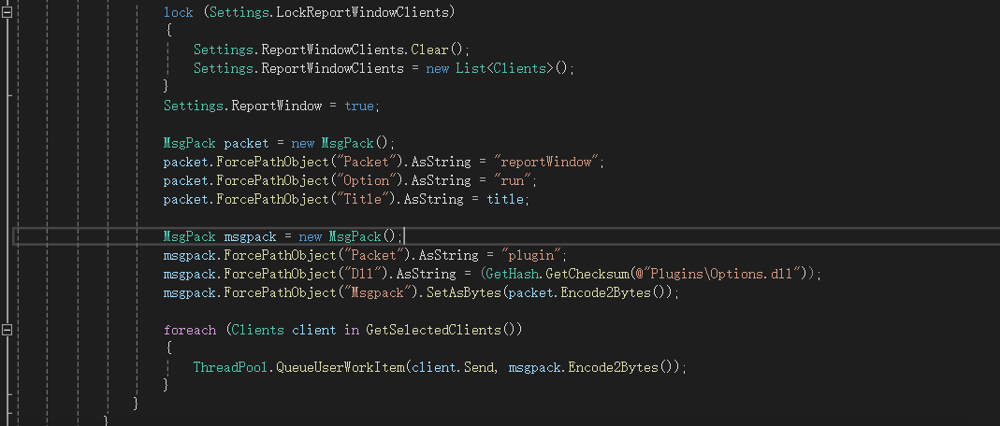

这个反射加载的是Options.dll


收到reportWindow


就是变量进程的窗口名有没有在list中的，有就发送当前循环的元素，初始化的时候赋值了需要监视的程序


## Webcam


发包主要分为捕获和停止


在RemoteCamera.dll中实现


当收到capture后

```
FilterInfoCollection videoCaptureDevices = new FilterInfoCollection(FilterCategory.VideoInputDevice);
```

使用 `FilterInfoCollection` 类和 `FilterCategory.VideoInputDevice` 获取系统上所有可用的视频输入设备（如摄像头）


```
FinalVideo = new VideoCaptureDevice(videoCaptureDevices[0].MonikerString);
```

从可用的视频捕获设备列表中选择第一个设备，并创建一个 `VideoCaptureDevice` 实例。`MonikerString` 是设备的唯一标识符，用于初始化视频捕获设备对象。


```
Quality = (int)unpack_msgpack.ForcePathObject("Quality").AsInteger;
```

从接收到的消息包（`unpack_msgpack`）中读取视频质量设置，并将其保存到 `Quality` 变量中。这允许远程调整视频捕获的质量。


```
FinalVideo.VideoResolution = FinalVideo.VideoCapabilities[unpack_msgpack.ForcePathObject("List").AsInteger];
```

根据消息包中的 `"List"` 字段设置视频捕获的分辨率。`VideoCapabilities` 属性包含设备支持的所有分辨率和帧率的列表，通过索引选择特定的分辨率配置。


```
FinalVideo.NewFrame += CaptureRun;
FinalVideo.Start();
```

为 `FinalVideo` 对象的 `NewFrame` 事件注册一个事件处理方法（`CaptureRun`），当有新的视频帧可用时会触发此方法。

调用 `FinalVideo.Start()` 方法启动视频捕获。


这里就是注册的处理方法

从事件参数 `e` 中获取当前视频帧，并克隆一份以便处理。

创建一个 `MemoryStream`（`Camstream`），用于存储压缩后的JPEG图像数据。

设置JPEG的质量，并将视频帧保存到 `Camstream` 中。

将获取到的图片在发回去server端就实现该功能，stop就是断开连接。


# Miscellaneous

## Bots Killer


反射加载的是Miscellaneous.dll


变量进程列表，把进程路径传入到Inspection方法中，如果是恶意文件就结束掉，并且删除文件，再删除注册表中的自启动项目


这个方法判断是否为恶意软件

首先排除当前进程

如果在C:\ProgramData目录中则认为恶意软件

进程路径位于当前用户的个人资料文件夹则判断为恶意

是否包含 `wscript.exe`。`wscript.exe`，是则判断为恶意

进程路径是否位于Windows的 `.NET` 文件夹中，是则判断为恶意


## USB Spread


反射加载的dll也是Miscellaneous.dll


当收到limeUSB的指令后，client会调用  new HandleBotKiller().RunBotKiller();


先会调用ExplorerOptions方法


```
@"Software\Microsoft\Windows\CurrentVersion\Explorer\Advanced"
```

Hidden设置为2意味着隐藏的文件和文件夹就不会在资源管理器中显示出来

HideFileExt设置为1这意味着例如 `.txt` 或 `.exe` 这样的文件扩展名将不会在资源管理器中显示


使用 DriveInfo.GetDrives() 方法获取系统上所有的驱动器，并遍历它们

检查它是否是可移动驱动器（如U盘）


会在u盘的根目录下新建一共$LimeUSB目录并设置为隐藏，在新建目录$LimeIcons在$LimeUSB中


在把当前的木马复制进去


调用CreateDirectory


对于每个子目录，检查它是否已包含名为 `Settings.WorkDirectory` 的目录。如果不包含，那么在该子目录路径的第三个字符位置插入 `Settings.WorkDirectory`，构造出新的目录路径，并创建该目录。


如何就是开始感染，这里遍历所有文件调用CheckIfInfected检查文件是否感染，如果没有感染则提取图标，将文件移动到刚刚新建的目录中


判断是否感染的方法是检查版本号是否匹配


这里把没有感染的文件的图标提取出去放在新建的图标目录中


然后在动态编译代码，原来还有CSharpCodeProvider类，能动态编译


```
using System;
using System.Diagnostics;
using System.Reflection;
using System.Runtime.InteropServices;

[assembly: AssemblyTrademark("%Lime%")]
[assembly: Guid("%Guid%")]

static class %LimeUSBModule%
{
    public static void Main()
    {
        try
        {
            System.Diagnostics.Process.Start(@"%File%");
        }
        catch { }
        try
        {
            System.Diagnostics.Process.Start(@"%Payload%");
        }
        catch { }
    }
}
```

将对应的遍历进行替换，替换成对应的图标，编译到指定的路径，这段代码就是启动木马，这样就替换了usb中的exe，实现感染的效果


## Seed Torrent


反射加载的是Miscellaneous.dll，我们直接看怎么实现的


这里还有两个指令没有完善，调用seed方法


先获取到uTorrent或者BitTorrent的安装路径，优先返回uTorrent，把种子保存为.torrent文件


然后以命令行的形式调用uTorrent或者BitTorrent，实现种子下载


## Remote Shell


这里调用的也是Miscellaneous.dll


开启一个cmd进程


为 `OutputDataReceived` 和 `ErrorDataReceived` 事件绑定了同一个处理器 `ShellDataHandler`，这个处理器负责处理来自命令行的输出和错误信息，也就是会把错误和结果发送给server


在server写入命令后，发送shellWriteInput的命令


修改InPut的值，然后while中就会读取命令


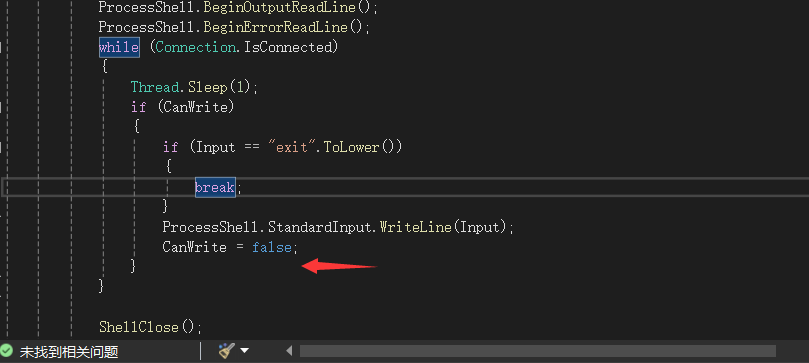

执行命令行在把CanWrite修改为false，放在重复执行，这样就实现远程shell


## DOS Attack


这里调用的也是Miscellaneous.dll


client收到dosAdd指令后，又发送dosAdd会到server


然后server端调用HandleDos().add


然后server在发送dos的指令


client端接受dos，在分为两个分支


然后就是一直发，每次发20然后间隔5秒接着发送请求，可奇怪了，为什么要在从client发回到server，然后server在发给client，client再dos，直接dos不行吗


## Execute .NET Code


这里发送的指令是executeDotNetCode，加载的Miscellaneous.dll


这里分支为了两种C#主要使用CSharpCodeProvider类，vb使用CSharpCodeProvider


生成可执行文件和生成到内存中，调用`codeDomProvider.CompileAssemblyFromSource`方法，传入编译参数和源代码字符串进行编译。


如果编译过程中有错误发生（`compilerResults.Errors.Count > 0`），则遍历并记录每个编译错误。使用`Debug.WriteLine`输出错误详细信息，并调用`Packet.Error`方法发送错误信息。


如果编译没有错误，从`CompilerResults`对象中获取编译好的程序集（`CompiledAssembly`），找到程序集的入口点（`EntryPoint`），创建一个程序集实例，并根据入口方法是否接受参数来调用该方法。


vb调用的也是这个方法，只是传入的类不一样，方法接受的参数都是CodeDomProvider，c#的类库好丰富


## file searcher


文件搜索再FileSearcher.dll中实现


获取传入的拓展名和文件大小


然后就是不断递归爆破匹配


# Extra

## Visit Website


默认访问谷歌，反射加载的是Extra.dll


然后就没有然后了


## Send MessageBox


弹窗也是反射加载Extra.dll


朴实无华


## chat


发送的指令是chatWitrInput


加载的chat.dll


client端接受到指令后调用HandlerChat().WriteInput方法


通过 `Console.Beep` 方法发出一个提示音，以通知用户有新的消息

将提取的消息内容追加到聊天窗口的 `richTextBox1` 控件中，并在消息末尾添加一个换行符，以确保每条消息都在新的一行显示。`Packet.GetFormChat.richTextBox1.AppendText` 方法用于向文本框中追加文本


## Get Admin Privileges


这里加载的是Options.dll


client端是这样实现的，其实就是调用runas


这里设置了一个runas，其实就是弹出一个uac框，如果被控机器点了是才能提权，否则就一直呆着


## Blank Screen


反射加载Extra.dll


client收到指令后调用HandleBlankScreen().Run();


这里调用winapi SwitchDesktop，emmm说是虚拟桌面，但是不是很清楚调用这个是干什么的


## Disable Windows Defender


反射加载Extra.dll


client接受的命令后，先判断当前是否为管理员权限，如果是则先通过修改注册表的方式关闭windows Defender，再调用CheckDefender方法


执行 `Get-MpPreference -verbose`，用于获取 Windows Defender 的配置信息


逐行读取结果

例如第一个if判断

测到输出行包含字符串 `"DisableRealtimeMonitoring"` 并且该行包含字符串 `"False"` 时，会调用 `RunPS` 方法执行 PowerShell 命令 `"Set-MpPreference -DisableRealtimeMonitoring $true"`

命令的作用是将 Windows Defender 的实时保护功能禁用，通过将 `-DisableRealtimeMonitoring` 参数设置为 `$true`，即开启该设置。其他条件也同理


RunPs直接通过新建进程执行powershell


## Set Wallpaper

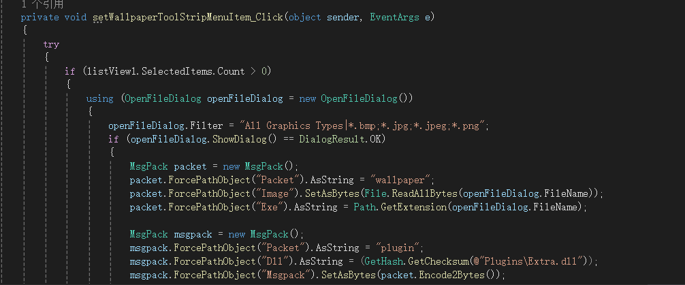

emmmm，感觉比较无聊的功能直接跳过吧


# builder

我主要了解一下功能

## Install


再client的代码中，如果设置了Install，则会修改注册表或者添加计划任务


检查当前进程是否就是install启动的进程，如果是则不会重复，然后再找到所有安装路径相同的进程，如果存在就关闭，防止因为再运行无法install的情况


如果是管理员，就添加计划任务，否则修改注册表添加自启动


这里写了个bat，运行安装的程序，然后延时执行删除自身，然后再退出当前程序，这样就能自删除了


## Anti Analysis

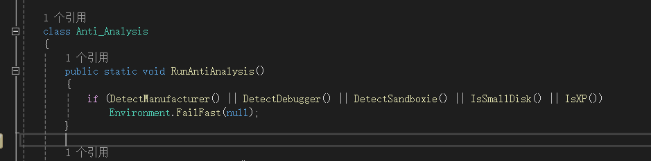

然后就是反沙箱的代码

`IsSmallDisk()`方法用于检测系统磁盘是否小于60GB

`IsXP()`方法用于检测操作系统是否为Windows XP

`DetectManufacturer()`方法用于检测计算机制造商，包括Microsoft、VMware和VirtualBox等。

`DetectDebugger()`方法用于检测是否存在调试器

`DetectSandboxie()`方法用于检测是否存在Sandboxie沙盒环境


使用 `ManagementObjectSearcher` 类来查询 Win32_ComputerSystem 管理对象，然后遍历查询结果。对于每个查询结果，它检查制造商（Manufacturer）和型号（Model）属性的值


调用用 `NativeMethods.GetModuleHandle` 方法来检查是否加载了名为 "SbieDll.dll" 的模块


这里调用 `NativeMethods.CheckRemoteDebuggerPresent` 方法来检查当前进程是否被调试器远程调试


最后两个都是直接调用winapi实现


## Process Critica

BSOD，全称Blue Screen of Death，即蓝屏死机。

当critical process退出时，会导致系统BSOD，所以如果我们将当前进程也设置为critical process，那么在进程退出时同样会导致BSOD


这里调用RtlSetProcessIsCritical函数将当前进程设置为critical process

第一个参数，设置为TRUE时，表示将当前进程标记为critical process；设置为FALSE时，当前进程不是critical process


这里注册了一个退出事件，如果设置了Process Critica，退出的时候会使用exit，然后被异常捕获，就捕获执行设置critical process的代码，再此之前需要使用`EnterDebugMode()` 方法，进入调试模式，允许当前进程获取调试权限。这样退出程序会触发蓝屏


## 初始化


Settings的值是如何初始化的?


再生成的过程中，会加载一个模板exe，然后调用WriteSettings往模板中写入配置信息


首先，生成一个32字符的随机字符串作为密钥，并创建一个 `Aes256` 加密实例来使用这个密钥。

接着，加载一个X.509证书，这个证书用于生成服务器证书和签名。使用证书的私钥来签名密钥的SHA256哈希，这个签名后续会被用于验证客户端的合法性。

代码遍历 `asmDef` 中定义的所有类型（`TypeDef` 对象）。对于名为 "Settings" 的类型，它进一步遍历该类型中的所有方法。

对于每个方法，代码检查方法体中的指令（`OpCodes.Ldstr` 操作码指示加载字符串的操作）。对于指定的字符串操作数，根据它们的内容，将其替换为加密后的配置值。例如：

如果操作数是 "%Ports%"，则替换为用户界面中指定的端口列表的加密字符串。

如果操作数是 "%Hosts%"，则替换为用户界面中指定的主机列表的加密字符串。

其他配置项如 "%Install%", "%Folder%", "%File%", "%Version%", "%Key%", "%MTX%", "%Anti%", "%Certificate%", "%Serversignature%", "%BDOS%", "%Pastebin%", "%Delay%", "%Group%" 等也以类似的方式进行处理。

这个过程中，所有敏感信息如端口、IP地址、安装路径等都会通过AES加密后写入程序集中，以增强安全性。

这种方式使得在不直接修改源代码的情况下动态地向程序集注入配置信息成为可能，同时通过加密确保这些信息不易被提取或篡改。


再client的模板文件都定义的都是这样的初始值，通过WriteSettings，把其中的变量都替换为了设置的值，学到了学到了，这样就能初始化了


## Simple Obfuscator


这里混淆调用的是Renaming.DoRenaming(asmDef);


最后调用的是RenamingObfuscation方法进行混淆，这里主要是对程序集中的命名空间、类、方法、属性和字段名称进行重命名


# 通信过程


client端会创建一个socket对象


判断是否设置了Pastebin模式


然后从输入的ip和端口中随机选择


如果是域名就先解析为ip然后连接，否则直接连接


如果设置了Pastebin，直接下载信息然后连接


连接成功以后就会使用TLS进行加密通信，发送客户端信息，设置心跳和Ping定时器，开始异步读取数据


读取到的数据就会使用ReadServertData这个方法读取


异步读取完数据后，会再起一个线程调用read方法


这个read就是我们熟悉的插件了


# 感受

阅读完这个框架以后，更多的感觉是可拓展性，实现具体的功能诸如注入、提权等等具体的细节其实没有什么技术含量，可能作者也没打算把有技术含量的东西写上去，最大的价值应该是这套思想。反射加载dll异步的处理任务，如果想继续拓展这个rat其实很简单，写一个dll，最少实现plugins命名空间和plugins类，然后把这作为plugin类似的指令发送给client即可，client就会去反射加载自己写的dll


让我好奇的是他是怎么生成client端的，发现原来可以通过这种方法修改程序集中的一些变量啊